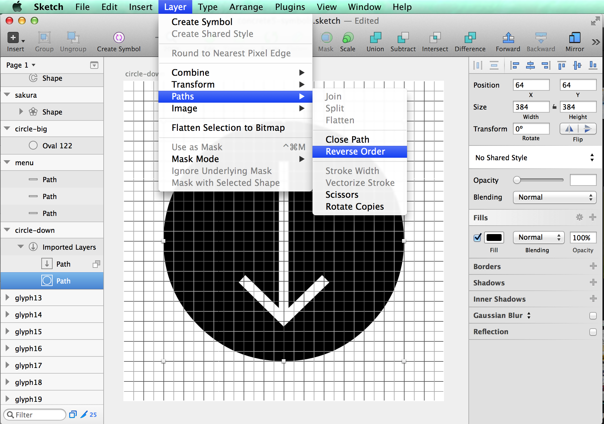

# Symbols for Sketch [](https://waffle.io/cognitom/symbols-for-sketch)


This repo contains a set of templates to make a symbol font (icon font) with [Sketch](http://bohemiancoding.com/sketch). What to do is ...

0. Setup Tools
0. Draw Icons
0. Gulp!

Just 3 steps! Enjoy making your original fonts ;-)


## Requirements

- Mac
- [Node.js](https://nodejs.org/)
- [Sketch](https://www.sketchapp.com/)


## Setup Tools

### Node.js and gulp.js

You need some command line environments. But don't worry. Almost all will be done through GUI.

Go to [http://nodejs.org/](http://nodejs.org/) and click the INSTALL link.


Open the file downloaded and install it into your mac.


### Download this repo

Download [this repo from GitHub](https://github.com/cognitom/symbols-for-sketch/archive/master.zip). Extract it into the folder you like. e.g. `/Users/yourname/Documents/your_icons`

Open Terminal.app. You may find it at `/Applications/Utilities/Terminal.app` as you know.

Go to the folder in Terminal.app:

```bash
$ cd /Users/yourname/Documents/your_icons
```

Install some tools into the folder:

```bash
$ npm install
```


### Sketch and Sketch Tools

You haven't got Sketch yet? Visit [their site](http://sketchapp.com/). It's worth more than its price tag. Sketch bundles CLI tool, too. You can use `sketchtool` command to extract the data from `.sketch` files.

Note: from ver 3.5, `sketchtool` has become an out-of-box feature. You don't have to install it seperately.


## Draw Icons

It's time to draw your icons!

- symbol-font-14px.sketch (default)
- symbol-font-16px.sketch

There're two templates. Difference between these are just grid size. The template contains 32 artboards to draw each icon. Of cause you can add more artboards if you need.


### Name convention

The name of the artboard is important. It define the name of not only the glyph but also the class of CSS.

- `icon_name`: The character code will be assign automatically
- `uF701-icon_name`: You can assign the code manually


## Gulp!

After saving your Sketch file, go back to Terminal.app again.

```bash
$ npm run symbols
```

Then check the `dist` directory. There'll be the font and CSS files generated.


### Config

You can change the detail as you like. See the [gulpfile.js](gulpfile.js) and modify it.

To change the name or style of your font, it would be enough just changing the part below:

```javascript
/**
 * Font settings
 */
 const fontName = 'symbols' // set name of your symbol font
 const className = 's' // set class name in your CSS
 const template = 'fontawesome-style' // or 'foundation-style'
 const skethcFileName = 'symbol-font-14px.sketch' // or 'symbol-font-16px.sketch'
```

### Live reloading

Try the command below in Terminal.app. This time you will get the browser open automatically.

```bash
$ npm start
```

Then, keep the browser open and change your icon on `symbol-font-*.sketch` and save it. Boom! Magic will happen. The output inside the browser will be also changed. It's really really convenient. You must try it out.


## CSS Styles

You can choose CSS Style templates, and make your own with [lodash template](http://lodash.com/docs#template).


#### (1) like Font Awesome

- respect to: [Font Awesome](http://fontawesome.io/)
- template: `css/fontawesome-style.css`

```html
<span class="s s-your_icon"></span>
```


#### (2) like Foundation

- respect to: [Foundation Icon Font 3](http://zurb.com/playground/foundation-icon-fonts-3)
- template: `css/foundation-style.css`

```html
<span class="s-your_icon"></span>
```


## Variants

### for Android Apps

See [variants/android](variants/android) directory.


## Behind the scenes

We use [gulp](http://gulpjs.com/) and some plugins.

- [gulp-sketch](https://github.com/cognitom/gulp-sketch): to export SVG files from `.sketch` files
- [gulp-iconfont](https://github.com/nfroidure/gulp-iconfont): to convert them into font files

To live-reload, we're using [browser-sync](https://browsersync.io/).

## Trouble Shooting

#### Case 1: Icons with circle 'filled' with black

Conditions like below.

- Icons which has an inner symbol with a circle or a box outside
- It seems OK with Chrome/Safari on Mac
- Not OK with Safari on iOS, Chrome on Android
- Not OK with IE on Windows

Solution: Revers Order of paths. See the screenshot below. Then Save and recreate the font.



#### Case 2: Can't export CSS/HTML

[gulp-iconfont](https://github.com/nfroidure/gulp-iconfont) has changed their API from v2 (June 2015), so we got to change our recipe a little bit.

- Event name: `codepoints` to `glyphs`
- Arguments passed: `codepoint` is equivalent to `glyph.unicode[0].charCodeAt(0)`

[See more detail](https://github.com/cognitom/symbols-for-sketch/blob/6cf363c0926f2ea00f7249c65cea7a279e590601/gulpfile.js#L17-L26).

#### Case 3: Transformed items appear outside the artboard

Conditions:

- rotated and/or transformed elements appear at wrong coordinates after export

Solution: Pipe [gulp-imagemin](https://github.com/sindresorhus/gulp-imagemin) before the iconfont task, which basically makes use of the [SVG Optimizer](https://github.com/svg/svgo) and collapses multiple transformations.


## History

- 2.1.0:
  - Added: live reloading (finally found [the solution](https://github.com/cognitom/symbols-for-sketch/blob/v2.1.0/gulpfile.js#L72-L78) in browser-sync)
  - Added: npm scripts. Now no need to install gulp globally
  - Changed: compatible with standard.js
- 2.0.0: ES6, WOFF2, and adding variations (for Android app by @weitsai)
- 1.2.0: Catch up versions, simplify the instruction
- 1.1.0: Catch up to [gulp-iconfont v2](https://github.com/nfroidure/gulp-iconfont)([svgicons2svgfont](https://github.com/nfroidure/svgicons2svgfont))
