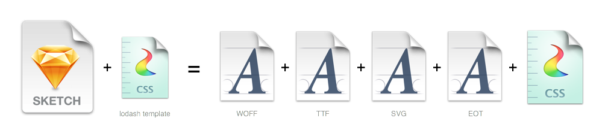
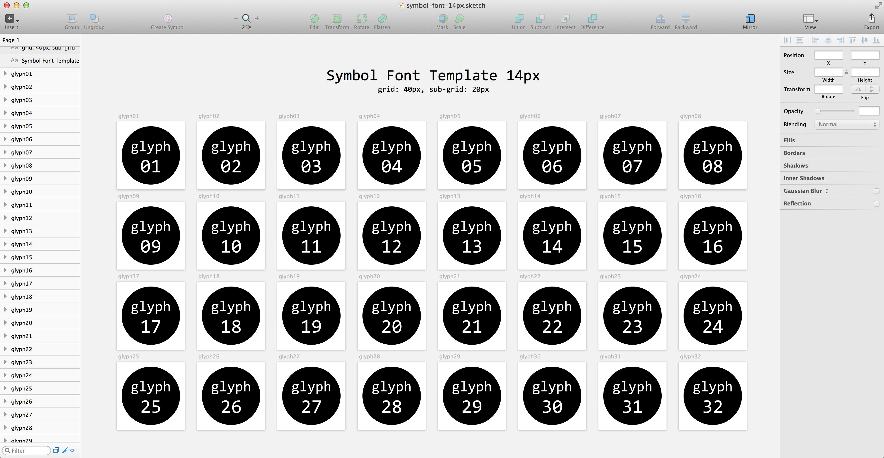
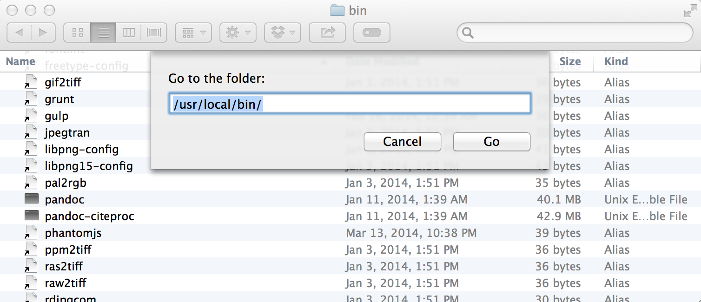
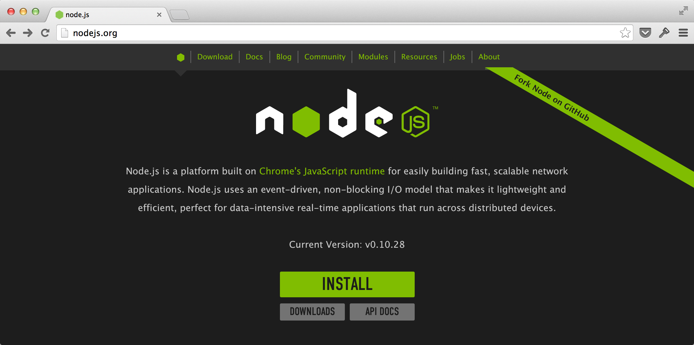
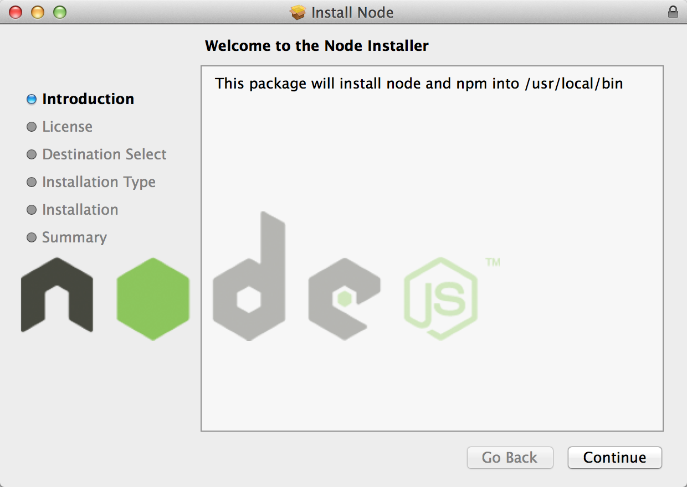
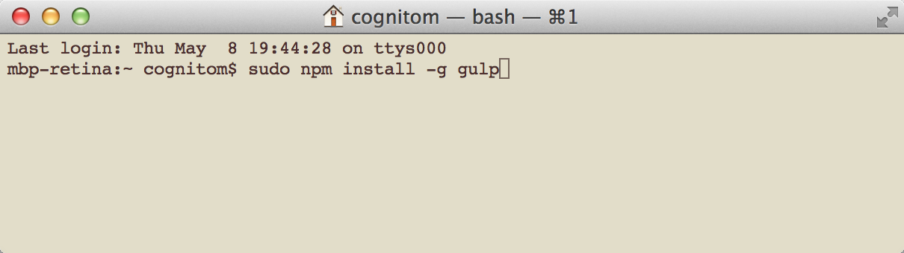
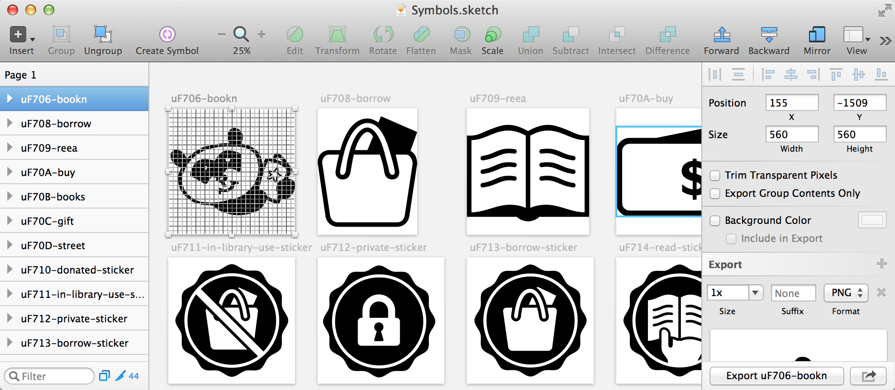

# Symbols for Sketch



This repo contains a set of templates to make a symbol font (icon font) with [Sketch](http://bohemiancoding.com/sketch). What to do is ...

0. Setup Tools
0. Draw Icons
0. Gulp!

Just 3 steps! Enjoy making your original fonts ;-)




## Requirements

- Mac
- [Sketch 3](http://bohemiancoding.com/sketch) and [Sketch Tools](http://bohemiancoding.com/sketch/tool/)
- [Node.js](http://nodejs.org/)
- [gulp.js](http://gulpjs.com/)


## Setup Tools

### Sketch and Sketch Tools

You haven't got Sketch yet? Visit [App Store](https://itunes.apple.com/jp/app/sketch-3/id852320343?l=en&mt=12). It's worth more than its price tag.

Download [Sketch Tools](http://sketchtool.bohemiancoding.com/sketchtool-latest.zip). Then extract it and save these 2 files into `/usr/local/bin`.

- sketchtool
- sketchtool resources.bundle 

To open `/usr/local/bin`, you can use "Go > Go to Folder..." menu command in Finder.




### Node.js and gulp.js

You need some command line environments. But don't worry. Almost all will be done through GUI.

Go to [http://nodejs.org/](http://nodejs.org/) and click the INSTALL link.



Open the file downloaded and install it into your mac.



Open Terminal.app. You may find it at `/Applications/Utilities/Terminal.app` as you know. Type the command below to install gulp.

```bash
$ sudo npm install -g gulp
```




### Download this repo

Download [this repo from GitHub](https://github.com/cognitom/symbols-for-sketch/archive/master.zip). Extract it into the folder you like. e.g. `/Users/yourname/Documents/your_icons`

Move to the folder in Terminal.app

```bash
$ cd /Users/yourname/Documents/your_icons
```

Install some tools into the folder.

```bash
$ npm install
```

We use these plugin for gulp.js, FYI.

- [gulp-sketch](https://github.com/cognitom/gulp-sketch)
- [gulp-iconfont](https://github.com/nfroidure/gulp-iconfont)


## Draw Icons

It's time to draw your icons!

- symbol-font-14px.sketch (default)
- symbol-font-16px.sketch

There're two templates. Difference between these are just grid size. The template contains 32 artboards to draw each icon. Of cause you can add more artboards if you need.


### Name convention

The name of the artboard is important. It define the name of not only the glyph but also the class of CSS.

- `icon_name`: The character code will be assign automatically
- `uF701-icon_name`: You can assign the code manually




## Gulp!

After saving your Sketch file, go back to Terminal.app again.

```bash
$ gulp symbols
```

Then check the `dist` directory. There'll be the font and CSS files generated.


### Config

If you want to change the name of your font, see the gulpfile.js and modify it.

```javascript
var gulp = require("gulp");
var rename = require("gulp-rename");
var sketch = require("gulp-sketch");
var iconfont = require('gulp-iconfont');
var consolidate = require('gulp-consolidate');

var fontName = 'symbols'; // set name of your symbol font
var template = 'fontawesome-style'; // you can also choose 'foundation-style'

gulp.task('symbols', function(){
  gulp.src("symbol-font-14px.sketch") // you can also choose "symbol-font-16px.sketch"
    .pipe(sketch({
      export: 'artboards',
      formats: 'svg'
    }))
    .pipe(iconfont({ fontName: fontName }))
    .on('codepoints', function(codepoints) {
      var options = {
        glyphs: codepoints,
        fontName: fontName,
        fontPath: '../fonts/', // set path to font (from your CSS file if relative)
        className: 's' // set class name in your CSS
      };
      gulp.src('templates/' + template + '.css')
        .pipe(consolidate('lodash', options))
        .pipe(rename({ basename:fontName }))
        .pipe(gulp.dest('dist/css/')); // set path to export your CSS

      // if you don't need sample.html, remove next 4 lines
      gulp.src('templates/' + template + '.html')
        .pipe(consolidate('lodash', options))
        .pipe(rename({ basename:'sample' }))
        .pipe(gulp.dest('dist/')); // set path to export your sample HTML
    })
    .pipe(gulp.dest('dist/fonts/')); // set path to export your fonts
});
```


## CSS Styles

You can choose CSS Style templates, and make your own with [lodash template](http://lodash.com/docs#template).


#### (1) like Font Awesome

- respect to: [Font Awesome](http://fontawesome.io/)
- template: `css/fontawesome-style.css`

```html
<span class="s s-your_icon"></span>
```


#### (2) like Foundation

- respect to: [Foundation Icon Font 3](http://zurb.com/playground/foundation-icon-fonts-3)
- template: `css/foundation-style.css`

```html
<span class="s-your_icon"></span>
```

